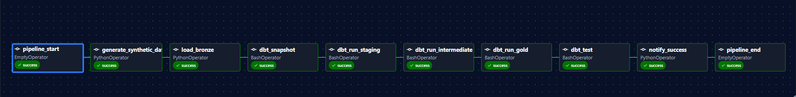
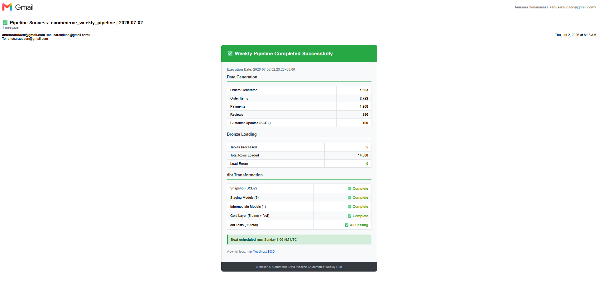
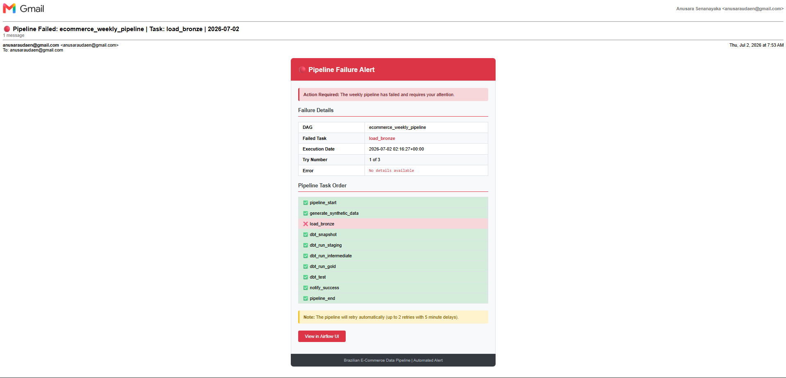
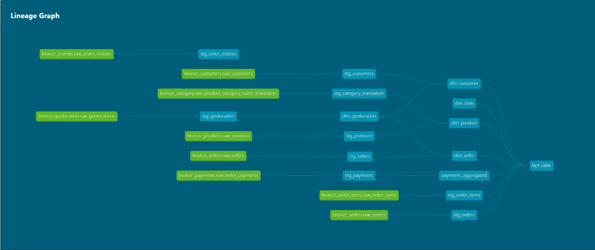
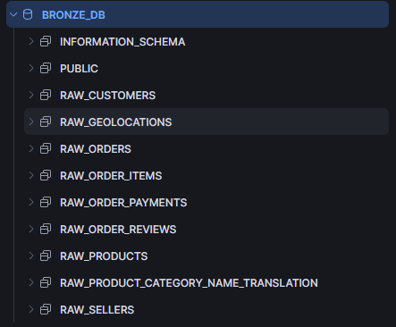
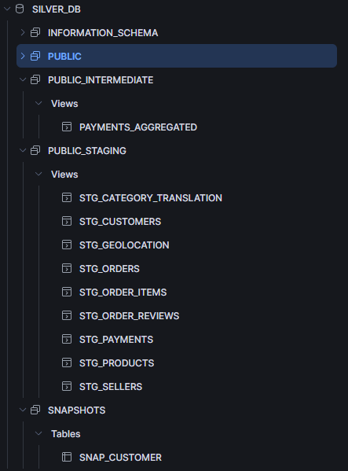
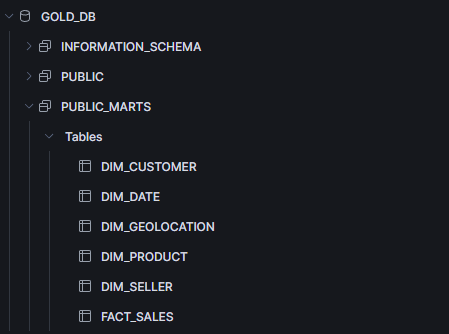
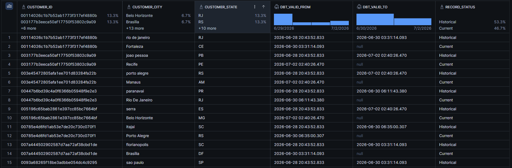

# Brazilian E-Commerce Data Pipeline

A production-style end-to-end data engineering pipeline built on real e-commerce transaction data. The pipeline ingests raw data from Azure Blob Storage into Snowflake, transforms it through a medallion architecture using dbt, orchestrates weekly runs with Apache Airflow, and delivers a clean star schema ready for Power BI analytics.

---

## Architecture

```
Azure Blob Storage
(CSV / JSON / Parquet)
        │
        │  Python COPY INTO (incremental)
        ▼
┌───────────────────┐
│   BRONZE LAYER    │  Raw landing zone — no transformations
│   Snowflake DB    │  9 tables, audit columns, load history
└────────┬──────────┘
         │
         │  dbt staging models (9)
         ▼
┌───────────────────┐
│   SILVER LAYER    │  Cleaned, typed, deduplicated
│   Snowflake DB    │  Staging + Intermediate models
│                   │  SCD2 snapshot (customer addresses)
└────────┬──────────┘
         │
         │  dbt marts (facts + dimensions)
         ▼
┌───────────────────┐
│    GOLD LAYER     │  Business-ready star schema
│   Snowflake DB    │  fact_sales + 5 dimensions
└────────┬──────────┘
         │
         ▼
   Power BI Dashboard
   (separate project)
```

**Orchestrated by Apache Airflow** — 10-task weekly DAG with retries, XCom data passing, and email notifications on success and failure.

---

## Tech Stack

| Layer | Technology | Purpose |
|---|---|---|
| Cloud Storage | Azure Blob Storage | Raw file landing zone |
| Data Warehouse | Snowflake | Bronze, Silver, Gold layers |
| Transformation | dbt Core | 16 models across staging, intermediate, marts |
| Orchestration | Apache Airflow 3.x | Weekly DAG, monitoring, alerts |
| Language | Python 3.13 | Data generation, ingestion, Airflow tasks |
| Version Control | Git / GitHub | Source control, commit history |
| Containerization | Docker Compose | Airflow infrastructure |

---

## Data Source

**Olist Brazilian E-Commerce Dataset** (Kaggle) — 100K real orders from 2016–2018 across 9 related tables: orders, order items, customers, products, sellers, payments, reviews, geolocation, and category translations.

To simulate a live pipeline against this historical dataset, a **synthetic data generator** creates 500–2,000 realistic new orders every week, referencing existing customer, product, and seller IDs from the real Olist data. This means the dimensions stay stable while the fact table grows continuously — which is how real e-commerce pipelines behave.

---

## Pipeline Flow

### 1 — Data Generation (weekly)

`data_generation/generate_weekly_data.py` generates synthetic orders, order items, payments, reviews, and customer address updates. Files are uploaded to Azure Blob Storage with date-stamped names so each week's data is clearly identifiable.

### 2 — Bronze Ingestion

Python uses Snowflake's `COPY INTO` command via an Azure External Stage. Snowflake's native load history means rerunning the command never duplicates data — files already loaded are automatically skipped. Each Bronze table has `_file_name` and `_loaded_at` audit columns for traceability.

### 3 — SCD2 Snapshot

Before dbt runs, `dbt snapshot` reads the Bronze customer table and tracks address changes over time. Customers who moved get a new record with `dbt_valid_from` / `dbt_valid_to` timestamps, preserving the full history of where each customer lived when each order was placed.

### 4 — dbt Transformations

Nine staging models clean and type-cast every source table. An intermediate model (`int_payments_aggregated`) solves a fan-out problem — Olist allows multiple payment rows per order, which would duplicate fact rows if joined directly. The intermediate model collapses payments to one row per order using `QUALIFY ROW_NUMBER()` before the fact table join.

Six Gold models build the star schema:

```
fact_sales (incremental)
    ├── dim_customer (with geolocation enrichment)
    ├── dim_product  (with English category translation)
    ├── dim_seller   (with geolocation enrichment)
    ├── dim_date     (2016–2027, full continuous spine)
    └── dim_geolocation (median lat/lng per zip prefix)
```

### 5 — Data Quality

93 dbt tests run after every transformation cycle:
- Unique and not_null tests on every primary key
- Referential integrity tests on all fact table foreign keys
- Accepted value ranges on review scores, coordinates, quarters
- Composite unique key test on `stg_order_reviews` (Olist reuses review IDs across orders — a real data quality quirk discovered during testing)

### 6 — Orchestration

A weekly Airflow DAG runs every Sunday at 6:00 AM UTC:

```
pipeline_start
      ↓
generate_synthetic_data   (PythonOperator)
      ↓
load_bronze               (PythonOperator)
      ↓
dbt_snapshot              (BashOperator)
      ↓
dbt_run_staging           (BashOperator)
      ↓
dbt_run_intermediate      (BashOperator)
      ↓
dbt_run_gold              (BashOperator)
      ↓
dbt_test                  (BashOperator)
      ↓
notify_success            (PythonOperator — HTML email)
      ↓
pipeline_end
```

Failure at any task triggers an HTML alert email showing which task failed, the error message, and a visual of the pipeline showing exactly how far it got before failing.

---

## Key Design Decisions

**Why incremental loading instead of full refresh**

Full refresh would reload all 100K+ Olist rows every week even though only a few thousand new synthetic rows arrive. Incremental loading using Snowflake's native COPY INTO load history means only genuinely new files are processed. On the dbt side, `fact_sales` uses `is_incremental()` with a `_loaded_at` timestamp filter for the same reason.

**Why medallion architecture with three separate databases**

Bronze, Silver, and Gold each live in separate Snowflake databases (not schemas in one database) to enforce access control cleanly — analysts get Gold access only, engineers get all three. Bronze is deliberately kept as raw VARCHAR columns so any ingestion error is preserved rather than silently dropped during type casting.

**Why dbt intermediate models exist**

The Olist payment table has one row per payment method per order — an order paid partly with a voucher and partly with a credit card has two rows. Joining payments directly into `fact_sales` would fan out every order item by the number of payment rows, silently doubling revenue figures. `int_payments_aggregated` solves this by collapsing to one row per order before the fact table join, selecting the dominant payment type by highest value.

**Why the geolocation dimension uses MEDIAN not AVG**

The same Brazilian zip code prefix appears dozens of times in the geolocation table with slightly varying coordinates. Using `MEDIAN()` rather than `AVG()` to produce a single representative coordinate per zip prefix is more resistant to any outlier coordinates that exist in the edges of zip code boundaries.

**Why SCD2 only on customers, not products or sellers**

Products and sellers don't change in the Olist dataset and change infrequently in real e-commerce. Customer addresses change when people move — and for revenue attribution ("which city generated this sale?"), it matters whether you use the customer's address at the time of purchase or their current address. The SCD2 snapshot preserves both.

---

## Bugs Found and Fixed During Build

These are worth documenting because each one taught something real about production data engineering.

**Fan-out from multiple payments per order** — discovered when building `fact_sales` and noticing revenue totals were inflated. Root cause: direct join of `stg_order_payments` to order items at different grains. Fix: `int_payments_aggregated` intermediate model.

**Duplicate customer_id in Bronze after weekly updates** — adding weekly synthetic customer address changes meant the same `customer_id` appeared multiple times in Bronze. The snapshot model uses `QUALIFY ROW_NUMBER()` to deduplicate before the SCD2 MERGE, and the staging model deduplicates to the latest record. Discovered when `dbt snapshot` threw a "duplicate row detected during DML action" error.

**Review_id uniqueness assumption broken** — the `unique` test on `stg_order_reviews.review_id` failed with 789 duplicates. Investigation showed Olist reuses the same `review_id` across different `order_id` values. Fixed by replacing the single-column unique test with `dbt_utils.unique_combination_of_columns` on `review_id + order_id`.

**dim_date spine too short for live data** — the date dimension originally covered 2016–2018 to match the Olist historical dataset. When the synthetic generator started creating orders with current-year timestamps, 16,135 fact rows had NULL `date_key` because no matching date existed in the dimension. Extended the spine to 2027.

**Airflow SMTP authentication using deprecated env vars** — `AIRFLOW__SMTP__*` environment variables are deprecated in Airflow 3.x. Airflow was attempting unauthenticated SMTP connections despite correct env var values, producing `530 Authentication Required`. Fixed by creating an `smtp_default` connection via `airflow connections add` CLI instead.

---

## Project Structure

```
ecommerce-pipeline/
│
├── airflow_orchestration/
│   ├── dags/
│   │   ├── ecommerce_pipeline_dag.py
│   │   
│   ├── logs      
│   ├── docker-compose.yml   
│   └── .env.example  
│          
│
├── Brazelian_E_Commerce/          (dbt project)
│   ├── models/
│   │   ├── staging/               (9 models)
│   │   ├── intermediate/          (1 model)
│   │   └── marts/
│   │       ├── facts/             (1 model)
│   │       └── dimensions/        (5 models)
│   ├── snapshots/
│   │   └── snap_customer.sql
│   ├── macros/
│   │   └── generate_schema_name.sql
│   ├── packages.yml
│   └── dbt_project.yml
│
│
├── data_generation
│   └── generate_weekly_data.py
│
│
├── data_loader
│   └──data_loader.py
│
│
├── snowflake/
│   └── setup/
│       ├── 01_warehouse.sql
│       ├── 02_databases.sql
│       ├── 03_roles.sql
│       ├── 04_schemas.sql
│       ├── 05_bronze_tables.sql
│       └── 06_stage.sql
│
├── docs/
│   └── screenshots/
│       ├── 01_airflow_dag_success.png
│       ├── 02_airflow_dag_failure.png
│       ├── 03_success_email.png
│       ├── 04_failure_email.png
│       ├── 05_dbt_lineage_graph.png
│       ├── 06_bronze_db.png
│       ├── 07_silver_db.png
│       ├── 08_gold_db.png
│       └── 09_scd2_snapshot.png
│
├── .env.example
├── .gitignore
└── README.md
```

---

## Screenshots

### Airflow DAG — Successful Run


### Success Email Notification


### Failure Alert Email


### dbt Lineage Graph


### Snowflake Bronze Layer


### Snowflake Silver Layer


### Snowflake Gold Layer


### SCD2 Customer Snapshot


---

## How to Run This Project

### Prerequisites

- Snowflake account (free trial works)
- Azure Storage account with a Blob container
- Docker Desktop installed
- Python 3.11+
- dbt Core with dbt-snowflake adapter
- Git

### Step 1 — Clone the repo

```bash
git clone https://github.com/AnusaraSen/ecommerce-pipeline.git
cd ecommerce-pipeline
```

### Step 2 — Configure environment variables

```bash
cp .env.example airflow_orchestration/.env
# Fill in your Snowflake and Azure credentials
```

### Step 3 — Set up Snowflake

Run these scripts in order in your Snowflake worksheet:

```
snowflake/setup/01_warehouse.sql
snowflake/setup/02_databases.sql
snowflake/setup/03_roles.sql
snowflake/setup/04_schemas.sql
snowflake/setup/05_bronze_tables.sql
snowflake/setup/06_stage.sql
```

### Step 4 — Load initial Olist data

Download the Olist dataset from Kaggle and upload the CSV files to Azure Blob Storage, then run:

```bash
python data_loader/data_loader.py full
```

### Step 5 — Set up dbt

```bash
cd Brazelian_E_Commerce
pip install dbt-snowflake
dbt deps
dbt run
dbt test
```

### Step 6 — Start Airflow

```bash
cd airflow_orchestration
docker compose up airflow-init
docker compose up -d
```

Open `http://localhost:8080` and trigger the `ecommerce_weekly_pipeline` DAG.

### Step 7 — Configure email notifications

```bash
docker compose exec airflow-worker airflow connections add smtp_default \
    --conn-type email \
    --conn-host smtp.gmail.com \
    --conn-login your@gmail.com \
    --conn-password 'your-app-password' \
    --conn-port 587 \
    --conn-extra '{"timeout": 30, "disable_tls": false, "disable_ssl": true}'
```

---

## dbt Model Summary

| Model | Type | Materialization | Description |
|---|---|---|---|
| stg_orders | Staging | View | Cleaned orders, typed timestamps, derived delivery flags |
| stg_customers | Staging | View | Cleaned customers, deduped to latest per customer_id |
| stg_order_items | Staging | View | Typed prices, derived order_item_total |
| stg_order_payments | Staging | View | Typed payment values, standardized payment types |
| stg_products | Staging | View | Typed dimensions, derived volume_cm3 |
| stg_sellers | Staging | View | Cleaned location fields |
| stg_geolocation | Staging | View | Typed coordinates |
| stg_order_reviews | Staging | View | Score validation, derived is_positive_review |
| stg_category_translation | Staging | View | Portuguese to English mapping |
| int_payments_aggregated | Intermediate | View | One row per order, dominant payment type |
| dim_date | Dimension | Table | Full date spine 2016–2027 |
| dim_customer | Dimension | Table | With lat/lng from geolocation |
| dim_product | Dimension | Table | With English category name |
| dim_seller | Dimension | Table | With lat/lng from geolocation |
| dim_geolocation | Dimension | Table | Median coordinates per zip prefix |
| fact_sales | Fact | Incremental | Star schema centre, order line item grain |

---

## What I Learned

The biggest gap between following tutorials and building something real is environment setup and debugging across multiple connected platforms simultaneously. A tutorial shows you one tool working in isolation. A real pipeline means Snowflake, Azure, dbt, Airflow, and Docker all need to work together — and when something breaks, the error message is usually in a completely different layer than where the actual problem is.

The most valuable debugging skill I developed was learning to trace errors upstream: when a dbt test fails, the root cause is usually in the staging model; when a staging model has wrong data, the root cause is usually in Bronze; when Bronze has wrong data, the root cause is usually in how the Python loader handled a specific file format. Following that chain consistently was what made everything eventually work.

---

## Future Improvements

- **Power BI Dashboard** — Connect to Gold layer, build revenue trends, geographic heatmap, customer segmentation, and product performance pages (planned as a separate analytics project)
- **Great Expectations** — Add source-level data quality validation before Bronze loading, catching bad files before they enter the warehouse
- **Snowpipe** — Replace the scheduled COPY INTO with event-driven ingestion triggered by Azure Event Grid when new files land in Blob Storage
- **dbt Slim CI** — Add GitHub Actions workflow that runs only the dbt models affected by each pull request, not the full project
- **Slack notifications** — Replace Gmail SMTP with Slack webhook notifications for more reliable alerting in a team environment

---

## Acknowledgements

Data source: [Olist Brazilian E-Commerce Dataset](https://www.kaggle.com/datasets/olistbr/brazilian-ecommerce) — made available under CC BY-NC-SA 4.0.

---

*Built as a portfolio project to demonstrate production-style data engineering practices.*